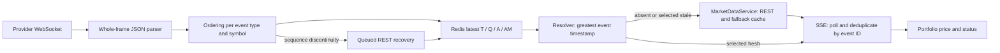

# MoneyBot stream stability and portfolio price investigation — 2026-10-09

**Status: OFFLINE_INVESTIGATION_COMPLETE; REPAIRS_PROPOSED_NOT_IMPLEMENTED.**

The current code has reproducible receive-loop delays, incorrect price-freshness attribution, and misleading portfolio status transitions. These are confirmed reachable mechanisms. Attribution of the three reported production keepalive failures remains **UNKNOWN**: this investigation did not measure the deployed event loop, frame queue, transport, or provider.

## Scope and source binding

Inspected branch `codex/v4-worker-identity-source-binding`, base revision `6ddb6de3edfbb0de9288673d8bbdd898a59ed6de`. No local `main` was assumed. The owner-reported deployment `5eb0795e2701d437fa86daca6d2b60dcff39f8dd` is unavailable as a local Git object (`git cat-file -t` failed); these reproductions are therefore **not an attestation of the exact deployed source bytes or settings**. No fetch was performed.

Only synthetic tests, a supporting offline runner, this report, and investigation notes in the Page 4/Page 5 checklists were changed. Production worker, provider, resolver, API, SSE, frontend, configuration, and saved evidence were preserved. No PR publication or production repair is part of this task.

The following evidence is supplied by the owner, not newly collected or independently reverified here:

| Existing observation | Meaning retained |
| --- | --- |
| Worker `moneybot-market-stream`; instance `56969804-5be8-4098-99c2-05bd11c7fa1f` | Identifies the reported lifecycle, not this test process |
| 14:10:22, 14:12:10, 14:14:24 UTC on October 9: code 1011, keepalive ping timeout, no close frame received; subsequent reauthentication/subscription | Confirms reported connection failures; does not identify their initiating cause |
| MHVYF recovery: no usable positive Massive snapshot price | Separate reported price-availability failure |
| Passive observation about 14:14:11–14:15:00: integrity PASS; `COMPLETE_WITH_UNKNOWNS`; 5 samples, 3 connected, 2 reconnecting | Original evidence classification preserved |
| About 24s valid comparison time, 88.8 messages/s; sequence-gap +1,401; slow-consumer +1,775; dropped-event +0 | Counters are not proof of 1,401 lost events; zero recorded drops is not proof of lossless delivery |
| Event-to-Redis p95 about 52s; Redis-write p95 about 1.3ms | Worker measurements are cumulative, not exclusive to this observation; short writes alone do not explain or exclude other stalls |
| Process RSS compliance UNKNOWN | No process/resource compliance claim added |

Original Stage B remains failed with `FEATURE_WINDOW_INVALID`. Independent saved-evidence replay PASS does not turn that execution into PASS. Existing UNKNOWN acceptance statuses and `OVERALL_STAGE_B: OPEN` remain unchanged.

## End-to-end path



`StreamEventParser.parse_message` (`market_stream.py:102–170`) synchronously parses the entire JSON frame. It normalizes T/Q/A/AM, takes aggregate end time `e` versus trade/quote `t`, and copies optional `q`/`i`. `_accept_event` (`:577–598`) uses `(event_type, symbol)` ordering state. Accepted events each incur synchronous Redis SET; coalescing applies to notifications, not those SETs (`:674–709`).

`LiveQuoteResolver._freshest_stream/resolve` (`live_market.py:82–136`) reads all four channels, chooses greatest **event** timestamp among finite-price candidates, then checks the selected candidate's stale flag. Receipt time does not refresh a price. Equal timestamps prefer T, Q, A, AM in that order. REST normalization instead prefers an eligible recent trade, then NBBO midpoint, minute close, and daily close. These different price definitions can change values on a source transition without proving a provider error.

`api.live_market_stream` (`api.py:2204–2282`) resolves every permitted symbol each loop, emits only changed `event_id`, and checks heartbeat after resolution. Initial `user_watchlist` enrichment (`:1459`, `:1524–1536`) uses `MarketDataService` directly, so initial rows lack the SSE's `live_market` metadata. Actual portfolio JavaScript is inline in `app_factory.py:1594–1645`, with grouped-lot handling at `:1844`.

## Confirmed findings and limits

Test references below use **W** = `tests/test_stream_worker_offline_investigation.py`, **R** = `tests/test_portfolio_resolver_offline_investigation.py`, **U** = `tests/test_portfolio_ui_offline_investigation.py`. Each test asserts existing reachable behavior; PASS does not approve that behavior. No P0 finding was established.

### Worker responsiveness and recovery

| ID / severity / confidence | Source and synthetic evidence | User impact and production risk |
| --- | --- | --- |
| W1 — P1 — confirmed mechanism | `RedisMarketStreamState` (`market_stream.py:248–312`), `process_raw_message`, `flush_updates_if_due`, `health_payload`, `reconcile`: synchronous SET/GET/PUBLISH/INFO and demand commands execute on the async loop. W `test_frame_processing_and_health_redis_commands_run_inline_without_loop_yield` advances fake time by 2s per command: 12 simulated seconds pass without the scheduled callback running. | Slow Redis/CPU work can delay receive and keepalive tasks. This test proves scheduling behavior, not a 12s production stall. Redis 1.3ms write p95 does not measure INFO, demand reads, database waits, parsing, or loop lag. |
| W2 — P1 — confirmed mechanism | `shadow_compare` (`:711–729`) awaits each eligible symbol's `to_thread(get_quote)` serially; `run_connection` (`:770–790`) awaits the entire cycle between receive calls. W `test_shadow_comparison_is_serial_and_adds_per_symbol_synthetic_latency`, `test_run_connection_does_not_drain_recv_during_awaited_shadow_cycle`, `test_default_rest_retry_cost_in_serial_shadow_uses_only_synthetic_time`. | Frames stop being consumed by the application during the batch; backlog and health-publication delays can grow. The REST await itself yields to other async tasks and is distinct from W1 event-loop starvation. |
| W3 — P1 — confirmed library behavior; incident link plausible/unconfirmed | `run` (`:807–809`) specifies `ping_interval=20`, `ping_timeout=20`, `max_queue=1024`. Installed/pinned websockets 16.0 `Connection.process_event`, `Connection.keepalive`, and `Assembler` are exercised by W `test_installed_websockets_full_frame_queue_pauses_transport_until_consumer_drains` and `test_installed_websockets_keepalive_timeout_branch_with_synthetic_unread_pong`. DATA frame 1025 pauses reading; draining to 256 resumes. A synthetic unfulfilled PONG reaches failure code 1011 and the exact timeout reason. | Receive backpressure can pause transport reading and leave later PONG bytes unread even while the loop runs. An already-parsed PONG is still acknowledged. The queue test and forced timeout branch do **not** establish that queue saturation caused any production timeout. Network/provider delays and loop starvation remain alternatives. |
| W4 — P2 — confirmed discontinuity/recovery logic; loss interpretation unknown | Parser `:132`, `_accept_event` `:578–596`, recovery enqueue `:697–698`. W `test_sequence_gap_counter_is_per_event_type_and_not_missing_event_count`: T(q10), Q(q11), T(q12) produces a T discontinuity; T(q100) adds one more, not 87 lost events. | The code assumes `q` contiguity within each event-type/symbol pair. Local documentation establishes no such provider guarantee. A discontinuity is not a confirmed loss. Legitimate skips and reconnect discontinuities may trigger avoidable recovery; production frequency attributable to this assumption is unknown. |
| W5 — P1 — confirmed scheduling/budget defect | `_queue_recovery`, `_recover_symbols`, `shadow_compare`, `run` (`:619–664`, `:720`, `:818–833`). W `test_queued_recovery_cooldown_does_not_limit_reconnect_bulk_recovery`, `test_shadow_and_queued_recovery_do_not_share_rest_concurrency_budget`, `test_reconnect_awaits_all_symbol_recovery_before_backoff_and_preserves_ping_settings`. | Queue safeguards work, but reconnect bulk recovery bypasses their cooldown/in-flight deduplication; separate concurrency limits allow overlapping REST work. A shadow lookup plus two queued recoveries yields three simultaneous lookups. Reconnection waits for all planned REST recoveries before backoff, extending outages when recovery is slow. Lookup counts do not automatically equal HTTP calls because caches/backoff intervene. |

Other inspected loop work: database demand SQL in `scripts/run_market_stream.py:54–60` is already offloaded through `_refresh_external_demand` (`market_stream.py:558–563`). Awaiting it still delays this receive loop; Redis registration and demand enumeration remain synchronous. Subscription sends/acknowledgements are awaited and initial acknowledgements are bounded at 10s. Whole-frame parsing and per-event processing are synchronous. Every health snapshot sorts each bounded 10,000-value metric deque three times, queries Redis INFO, and performs health SET; health is published on receive iterations, not merely once per 30s TTL. CPU/SQL contribution to the incident was not measured.

The optional application-message heartbeat defaults to disabled (`heartbeat_timeout_seconds=0`); the transport's 20s ping/20s timeout remains active. Worker instance ID/source revision survive reconnects; `connected_at` changes. `_last_event` survives reconnects too: lower subsequent sequences are rejected as out of order. Whether this matters depends on provider sequence scope/reset guarantees, which are unresolved for T/Q and must not be invented for A/AM. Missing `q` falls back to timestamp ordering; equal IDs/sequences are duplicate observations, lower sequences are out-of-order observations, and reconnect-crossing jumps are not proof of within-session loss.

Existing recovery safeguards remain useful: queue 512, concurrency 2, cooldown 30s, in-flight deduplication, bounded subscription caps, TTLs, stale marking, bounded reconnect backoff, and provider caches. Cooldown also suppresses immediate repeats after failed queued recovery; queue overflow records its own counter and marks affected state stale. Separate reconnect/shadow budgets are the remaining problem.

**Shadow-duration estimate, not an operational maximum:** with default 6s request timeout and two retries, a fully timed-out symbol can cost `3 × 6 + 0.2 + 0.4 = 18.6s` in a simplified timeout model. The actual retry implementation reproduces 55.8 simulated seconds for three symbols. For 65 eligible symbols the same assumptions give 1,209s (about 20m). Eligibility, caching, client backoff, failures and request behavior change the result; requests' timeout is not a strict whole-call deadline. There is no worker-wide batch time budget. Shadow selection uses T, then A, then AM and ignores stored stale/age; Q-only symbols are not compared. Stale positive stored prices can therefore cause unnecessary comparisons. Batch time delays the next comparison deadline and can exceed health TTL30s.

The 88.8 observed messages/s cannot be converted into time to fill a **frame** queue without frame-batching measurements. Gap and slow-consumer counts are cumulative classifications, not queue occupancy: `slow_consumer_events` increments when event age plus write duration exceeds 2s (`:688–693`). Zero recorded drops excludes neither backlog nor loss upstream of received frames. The lag calculation captures age at parsing plus a write's duration, not all processing elapsed before later writes in a multi-event frame.

### Quote selection and freshness

| ID / severity / confidence | Source and synthetic evidence | User impact and production risk |
| --- | --- | --- |
| R1 — P1 — confirmed false freshness | `MassiveRestClient._normalize_snapshot` (`market_data_providers.py:533–610`) calculates event time as max(trade, quote, minute, ticker.updated), independently from the price chosen. R `test_recent_ticker_updated_can_mark_stale_selected_price_as_fresh`, `test_selected_trade_with_missing_timestamp_inherits_unrelated_snapshot_freshness`, `test_snapshot_trade_precedence_differs_from_stream_freshest_event_selection`. A five-minute-old price plus current ticker.updated gets `stale_price_fallback` **and** `is_stale=False`; service calls it available. | An old or undated selected price can be represented as current, affecting displayed price/P&L and decisions. This is a confirmed defect independent of the WebSocket failures. Actual held-symbol occurrence was not measured. |
| R2 — P1 — confirmed frozen freshness | Service TTL cache (`market_data.py:28–43`, `:58`, `:1506–1515`, `:1579`) returns the same payload for 20s; resolver (`live_market.py:120–133`) trusts its age/stale fields. R `test_outer_service_cache_keeps_freshness_fixed_after_threshold`, `test_rest_freshness_flags_are_trusted_without_recomputing_event_age`. At elapsed19s a fetched age0 quote still advertises age0/fresh. | Cached prices can cross the 15s regular threshold without changing status. A successful stale Massive quote also terminates the fallback cascade; repeated REST success does not necessarily produce a recent price. |
| R3 — P2 — confirmed unnecessary fallback and backwards time | Resolver candidate selection (`live_market.py:82–119`) precedes stale filtering and keeps no prior accepted timestamp. R `test_newest_marked_stale_candidate_masks_older_healthy_candidate`, `test_equal_timestamp_recovery_quote_can_be_masked_by_stale_trade`, `test_fallback_to_delayed_healthy_stream_can_regress_price_and_event_timestamp`. | A newer marked-stale T or tied stale T masks a valid recent Q and induces REST. A delayed but <15s stream event can replace a newer REST result already displayed, moving price time backwards. |
| R4 — P2 — confirmed contract mismatch | `_recover_symbol` writes Q `midpoint` and `recovery_price` (`market_stream.py:599–612`); resolver Q handling (`live_market.py:78–80`) uses midpoint only. R `test_trade_only_rest_recovery_price_is_not_used_as_quote_midpoint` supplies a recovery-shaped record. | A valid recovery trade price without NBBO is unusable to this resolver and can trigger separate service REST resolution. Recovery does not clear every stale T/A/AM key. Test is a contract reproduction, not execution against MHVYF. |
| R5 — P1 — confirmed validation boundary | `_number` and `_stream_price` (`live_market.py:25–34`, `:72–80`, `:107`) require finite values but not positive prices. R `test_stream_accepts_finite_nonpositive_price_as_live` covers zero and -1. | Synthetic invalid stock prices can be labelled fresh and flow to P&L. No real nonpositive event was observed. Stock price validation should match the provider's positive-price contract without inventing replacements. |
| R6 — informational — confirmed policy; symbol-specific explanation unknown | Event-based regular15s/pre60s/after60s/closed24h thresholds (`live_market.py:93–96`), independent of receipt. R `test_recent_receipt_does_not_refresh_old_event`, `test_regular_session_cutover_uses_event_age_at_15_seconds`, `test_pre_after_and_closed_thresholds_use_event_session`, `test_session_boundary_uses_event_session_not_current_session`. | Inactive/thin symbols legitimately age into fallback even with connected provider health. A fresh aggregate is eligible without recent T/Q. Event-session policy can keep a premarket event fresh at 40s after opening, or mark a regular event stale at 20s just after closing; closed-session data may remain eligible for 24h. These are policy boundaries, not proof of disconnect. Do not loosen them merely to reduce warnings. |
| R7 — P2 — confirmed error-cache gap; reported MHVYF cause unknown | HTTP-success raw cache 2s versus error negative cache 30s (`market_data_providers.py:391–399`, `:463–507`, `:619–630`). R `test_unusable_success_snapshot_has_only_raw_two_second_cache`, `test_transport_retries_are_bounded_and_errors_negative_cached`, `test_forbidden_error_is_not_retried_and_is_negative_cached`. | A successful snapshot with no positive price raises after request caching, outside negative-error caching. Direct repeated calls can refetch after 2s. MHVYF's reported error is a separate availability issue; no evidence ties it to ping failures, guarantees recent eligible trades, or authorizes a substitute price. |

Reported subscriptions A65/AM65/Q2/T2 imply most symbols must obtain recent aggregate prices to stay stream-fresh; there is no guarantee every eligible symbol emits a new price within 15s. Real liquidity, provider filtering/entitlement, aggregate timing and selected fields are unverified. Numeric freshness and provider connectivity must be represented separately.

### SSE and portfolio display

| ID / severity / confidence | Source and synthetic evidence | User impact and production risk |
| --- | --- | --- |
| U1 — P1 — confirmed withheld status | SSE event-ID check (`api.py:2246–2248`); REST IDs use timestamp only (`live_market.py:126–135`). U `test_actual_sse_route_suppresses_same_id_fresh_to_stale_transition` executes the real decorated route/generator in a minimal Flask context with the real resolver, no database/listener: same-ID REST fresh→stale yields no second quote while heartbeat continues. | An unchanged price timestamp can hide stale/degraded/flag changes and even changed price. Browser can retain a Live label. `Last-Event-ID` is echoed in ready, not used to replay missed events; polling after a new connection sends current state. |
| U2 — P1 — confirmed source/connectivity conflation | `livePriceCell`, `applyPortfolioLiveQuotes`, heartbeat (`app_factory.py:1594`, `:1624`, `:1637`); resolver degradation rule (`live_market.py:133`). U fresh REST, provider-connected/disconnected, and heartbeat tests. | Fresh REST with no stream candidate is called Live. Fresh REST with stale stream is called REST fallback. Neither label identifies upstream transport state; a heartbeat sets green regardless of stale rows. This can reproduce visible label changes without a change in worker connection state. |
| U3 — P1 — confirmed inconsistent portfolio summary | `applyPortfolioLiveQuotes` (`app_factory.py:1624`) checks only the incoming delta. U `test_mixed_portfolio_partial_update_hides_other_rows_staleness`, `test_mixed_portfolio_full_batch_marks_banner_degraded`. | One stale row makes a full batch amber; a later fresh-only batch makes the banner green while that row stays stale. Whole-portfolio quality is not consistently represented. |
| U4 — P2 — confirmed missing/retained misleading metadata | Initial enrichment `api.py:1459–1789`; `livePriceCell` `app_factory.py:1594`; numeric gate `:1613`. U `test_initial_watchlist_row_without_live_metadata_is_labelled_live_unknown`, `test_missing_quote_price_cannot_replace_last_known_value_or_row_metadata`. | Missing metadata defaults to Live/unknown, including unavailable-price fallback paths. Null-price updates retain both last value and old Live metadata. Keeping the number is useful; keeping verified-live status is misleading. |
| U5 — P2 — confirmed inaccurate reconnect copy | `startPortfolioLive.onerror` (`app_factory.py:1642–1644`). U `test_browser_sse_error_keeps_price_and_row_label_without_rest_fetch`, `test_sse_reconnect_heartbeat_recovers_banner_without_new_quotes`. | Handler changes banner only; it schedules no REST refresh despite claiming to use it. Native EventSource may reconnect. A heartbeat alone restores green without a new quote. Native browser/network reconnection performance was not tested. |

Required eight-case coverage is present in U: (1) SSE connected/provider disconnected; (2) SSE connected/provider connected; (3) fresh REST; (4) stale REST; (5) fresh aggregate; (6) inactive thin stock; (7) mixed fresh/stale portfolio; (8) reconnect heartbeat and subsequent fresh data selection. Connected/disconnected worker-health fixtures produce indistinguishable quote status because the resolver does not read health. Node executes actual inline functions using a mocked DOM/EventSource, not a hosted browser.

Separate facts the eventual UI should show: browser feed connected/interrupted; provider connected/reconnecting/unknown with a health timestamp; row source (stream trade/quote/aggregate, REST, fallback); row price time/freshness; portfolio-wide unavailable/stale count. An unavailable or old value should stay honestly labelled last known. Existing quote tests also verify grouped lots, P&L, EventSource replacement and unchanged advice/score; price updates do not initiate AI regeneration.

## REST and Redis amplification estimates

These are code-derived estimates, not measured provider usage. Assume defaults: one-second SSE interval, cap25, one service singleton/cache per web process, negligible response latency, continuously demanded distinct symbols, successful positive primary snapshots, and no extra watchlist/manual/summary traffic.

| Work | Estimated rate / demonstrated bound |
| --- | --- |
| Repository reads | Four latest-key reads per symbol per iteration, even when only aggregates are subscribed: about 100 reads/s or 6,000/min per 25-symbol SSE connection. Trigger evaluation may add an AM read for an emitted quote. Multiple connections repeat reads. |
| REST service resolutions | One `get_quote` per absent/stale/invalid selected symbol per iteration, including cache hits: up to 25/s under those assumptions. Resolution happens before SSE deduplication. |
| Successful primary HTTP | Cache 20s and per-symbol lock coalesce within one web process: about 3/min per continuously stale symbol; 25 symbols about 75/min/process. R thin/active test makes 61 thin resolutions but only 3 mocked requests (t=0,21,42); continuously fresh active symbol makes none. |
| Process fanout | Cache is local: P processes continuously serving the same N stale symbols can approach 3NP successful primary requests/min. Browser count within one process does not imply one request per browser. |
| Retryable primary failure | Up to 3 attempts per uncached primary cycle; endpoint/key-specific negative cache 30s then suppresses repeats. 403 makes one attempt;429 can impose client-wide backoff/Retry-After. Outer fallback caching can further delay retries. |
| Full fallback cycle | R `test_full_fallback_cascade_has_bounded_application_attempts_and_outer_cache` reproduces 3 Massive transport attempts + 1 Finnhub + 1 Twelve Data + 3 Yahoo `info` invocations. These are 8 application attempts, not 8 proven HTTP requests; Yahoo internal fanout is unbounded from these call sites. Finnhub403 symbol blocking and Twelve Data rate-limit backoff further constrain persistent errors. |
| Independent worker work | Shadow/recovery use a separate client, snapshot cache 2s, queued cooldown 30s, and separate budgets. Reconnect bypasses queued cooldown. Do not equate every sequence discontinuity or service cache hit with an outbound request. |

REST/fallback resolution is synchronous in the SSE generator, and symbols are resolved serially. Slow cache misses/retries also delay browser quote/heartbeat delivery; configured 1s/15s are scheduling targets, not whole-loop deadlines. Actual deployed process count, configurations, provider traffic, cache hit rates and fallback availability remain unknown.

## Proposed correction set — owner review required

No correction below has been implemented. Keep the existing worker/Redis/resolver/SSE architecture. Each step needs focused offline acceptance tests before an implementation PR; deployment and operational validation require **separate** authorization.

| Order / files and functions | Intended correction and necessity | Compatibility and provider cost | Regression tests, rollback and operational prerequisites |
| --- | --- | --- | --- |
| C1 — P1; `market_stream.py`: frame processing, publication, health, reconciliation | Offload blocking Redis operations with ordered awaits and a bounded execution path; sample INFO/percentiles/health on a fixed cadence. Preserve per-symbol ordering and TTL/stale writes. DB demand is already offloaded: do not rewrite its SQL. Bound/yield long CPU batches where measured synthetic work requires it. Removes W1 scheduling exposure. | Retain repository key/schema, counters, identity, source revision, subscription authorization/caps, acknowledgement checks and reconnect settings. No extra provider calls; avoid extra Redis command volume. | Invert W1 into responsive-loop assertions under delayed fake Redis/INFO, large frames and demand snapshots; verify ordering, health TTL, cancellation and no drops. Roll back isolated worker code patch. Any deployed evaluation needs approved single-worker rollout, loop-lag/Redis-command timings and sustained market-hour comparison. |
| C2 — P1; `market_stream.py`: `shadow_compare`, recovery helpers, `run_connection/run` | Run at most one bounded shadow batch outside the receive-draining path; skip stale/unusable comparison candidates, give comparison work an explicit budget, and share one REST concurrency/in-flight/cooldown budget across comparison/queued/reconnect paths. Reconnect promptly with state marked stale instead of waiting for all REST repairs; ensure delayed recovery cannot overwrite newer state and cancel/join tasks on stop. Addresses W2/W5 without widening ping timeouts. | Preserve warnings, health schema, auth/subscriptions, 20s keepalive, queue caps, stale flags and positive-price requirements. Provider cost should decrease; do not add unbounded per-symbol tasks. Preserve current discrepancy accounting or document additive skip/duration diagnostics. | Delayed REST must coexist with continued recv/PONG processing; bounded aggregate concurrency, no duplicate cycles, failed/no-price recovery, health refresh, reconnect-first behavior and delayed-write ordering. Roll back isolated scheduling patch. Deployment needs independent permission and queue/pause/ping/cycle-duration telemetry to test W3 causation. |
| C3 — P1; `market_data_providers.py`: `_normalize_snapshot/get_quote`; `market_data.py`: cache reads; `live_market.py`: REST validation | Bind age/freshness to the selected price's own timestamp; missing timestamp stays unknown/stale. Return cached values with age/status recomputed without refetching or mutating shared objects. Require finite positive stock prices. Negative-cache unusable positive-price normalization failures under an explicit short bounded policy rather than repeatedly requesting them after 2s. Addresses R1/R2/R5/R7. | Keep normalized fields and existing price-precedence policy; disclose corrected timestamp semantics to consumers. Keep caching/rate limits and 15s regular freshness; status changes must not increase request rate. Do not synthesize prices or automatically fan out to more fallback providers for every stale value. | Old trade/current ticker.updated, undated price, threshold crossing inside cache lifetime, independent cache instances, zero/negative values, no usable snapshot, later valid recovery, retry/backoff tests. Roll back isolated normalization/cache patch. Before any rollout, review consumers of event_timestamp and configured freshness/negative-cache policy; validate thin symbols separately under approved access. |
| C4 — P2; `live_market.py`: `_freshest_stream/_stream_price/resolve`; `market_stream.py`: recovery serialization; SSE delivery state in `api.py` | Choose eligible healthy channels before unnecessary REST fallback. Define an explicit REST-recovery price contract without relabelling trade price as NBBO midpoint. Preserve a newer last-delivered price when delayed older stream/recovery data arrives, while still updating stale/source diagnostics. Addresses R3/R4. | Keep existing T/Q/A/AM payloads compatible; any recovery metadata is additive, source_mode remains REST. Scope monotonic delivery memory to the existing SSE connection rather than introducing global pricing storage. Define explicit reset/correction rules; stateless `/api/quote` cannot promise history it does not retain. Avoid fetching REST merely to compare every fresh stream price. | Masked/stale ties, missing NBBO with valid trade, older stream after REST, newer valid recovery, no positive replacement, reconnect reset and session boundaries. Roll back isolated resolver/delivery patch. Owner must approve monotonic delivery and event/current-session policy; no freshness loosening implied. Operational tests require separately approved high-volume and thin-symbol samples. |
| C5 — P1; `api.py`: SSE publication; `app_factory.py`: portfolio source/status functions and initial metadata handling | Publish meaningful price/source/stale/degraded/flag changes even with unchanged provider event ID; retain event IDs for compatibility and use a separate delivery fingerprint. Split browser-feed state from quote quality; render source explicitly, summarize all retained rows, update metadata for unavailable prices, use unknown when metadata is absent, and correct reconnect copy. Map verified metadata from initial quote enrichment additively. Addresses U1–U5. | Preserve authentication, permissions, caps, event names, demand cleanup, grouped lots, P&L and advice triggers. Do not trigger narrative/advice refresh for status changes. Upstream health needs an additive timestamped/TTL-checked contract; absent health means unknown. Avoid extra provider calls and per-tick age-only emissions. | Invert U misleading-label tests; all eight scenarios, status-only emission, null value, partial delta, heartbeat, unchanged advice and cleanup. Roll back the paired API/UI patch together. Separate deployment approval and retail-readable acceptance review; then independently authorize browser/provider outage validation. |
| C6 — P2; `market_stream.py`: `_accept_event` and epoch transition; sequence documentation/tests | Preserve explicit discontinuity telemetry and distinguish it from confirmed loss. Change `q`-driven recovery/ordering only after provider guarantees for scope, skips and resets are documented. Where contiguity is not guaranteed, a numeric jump alone must not assert loss; use justified freshness/continuity evidence for recovery. | No silent warning suppression or invented prices. Keep duplicate/out-of-order diagnostics. Do not apply a universal T/Q sequence rule to A/AM without field guarantees. Reduced false recoveries can reduce cost. | Per-channel interleaving/skips, missing q, equal ID/q, decreasing q, reconnect epoch/reset, confirmed stale recovery, preserved counters. Roll back isolated sequence patch. Exact sequence-contract evidence and owner approval of the interpretation are prerequisites; no live provider requests authorized now. |

C1/C2 can proceed independently of quote/display corrections. C3 precedes C4/C5 so the UI receives trustworthy price time and status. C6's semantic change is conditional on provider-contract evidence. The checked-in queue64/shadow-price descriptions in `docs/massive_stream_shadow_worker.md` differ from current queue1024 and the resolver's direct fresh-stream behavior; reconcile those claims during the approved repair without silently changing routing in this investigation.

Additional future evidence needed to decide the incident cause: exact deployed source/config binding; loop-lag distribution and longest stall; Redis GET/SET/INFO/demand durations; DB demand duration; frames/events per frame, queue depth and transport pause intervals; ping/PONG timestamps; comparison/recovery durations and cache results; provider close/network timing; process RSS/CPU and per-symbol market event/price times. Collection requires separate owner-approved instrumentation, deployment and observation boundaries. No longer ping timeout or looser stale threshold is justified by the available evidence.

## Test execution and integrity

All final focused tests ran with the project's `.venv` Python, fake transports, synthetic market inputs/clocks and no production database. The Node VM has a synthetic EventSource/DOM and no network implementation. Python fixtures deny socket/DNS operations. `tests/offline_investigation_runner.py` additionally installs inherited Linux x86_64 seccomp filters denying new non-AF_UNIX sockets/socketpairs and all `connect` syscalls; the Node children inherit the filter. AF_UNIX socketpairs permit asyncio's local wake-up pipe. The runner self-checks IPv4/IPv6 socket denial and connect denial before pytest, failing closed if enforcement is unavailable. Network namespaces were unavailable (`/proc/self/uid_map` read-only); kernel filtering was successfully used instead.

The outer environment also denies `socket.send` on a local Unix socketpair, independently of this runner. An initial expanded run completed 80 cases then stalled in the existing `test_sequence_gap_recovery_is_queued_deduped_and_does_not_block_processing`; one isolated diagnostic attempt also stalled. Both were terminated. Faulthandler showed an idle completed executor and sleeping event loop; a local-only diagnostic reproduced EPERM on Unix `send`, while `os.write` on the same local pipe worked. The runner now uses `os.write` **only on asyncio's AF_UNIX wake-up socket**, enabling mocked real-thread completion without permitting external sockets/connections. The isolated existing test then passed, and the complete final command below passed. These two interrupted attempts are environmental diagnostics, not failed assertions or a production defect.

Final command (repository root):

```sh
.venv/bin/python -B tests/offline_investigation_runner.py -q \
  --junitxml=work/stream_portfolio_offline_pytest.xml \
  tests/test_stream_worker_offline_investigation.py \
  tests/test_portfolio_resolver_offline_investigation.py \
  tests/test_portfolio_ui_offline_investigation.py \
  tests/test_live_market.py tests/test_live_market_api.py tests/test_live_ui.py \
  tests/test_market_data_providers.py \
  tests/test_market_stream.py::test_parser_normalizes_all_subscribed_event_types \
  tests/test_market_stream.py::test_parser_normalizes_quote_and_trade_scalar_conditions \
  tests/test_market_stream.py::test_parser_preserves_quote_and_trade_list_conditions \
  tests/test_market_stream.py::test_parser_defaults_missing_quote_and_trade_conditions_to_empty_lists \
  tests/test_market_stream.py::test_parser_rejects_malformed_unknown_and_wildcard_events \
  tests/test_market_stream.py::test_sequence_gap_recovery_is_queued_deduped_and_does_not_block_processing \
  tests/test_market_stream.py::test_redis_ttl_and_abandoned_browser_demand_expire \
  tests/test_market_stream.py::test_worker_config_defaults_to_disabled_shadow_and_bounded_budget \
  tests/test_market_stream.py::test_worker_lifecycle_metadata_stable_unique_utc_and_secret_free
```

Final result: **85 passed in 3.34s**, kernel network guard PASS and local asyncio thread wake-up PASS. Counts describe the final completed run, not sums of repeated diagnostic/agent executions. JUnit output is in `work/stream_portfolio_offline_pytest.xml`.

| Final focused group | PASS | FAIL | XFAIL | Skipped pytest cases |
| --- | ---: | ---: | ---: | ---: |
| New worker reproductions | 10 | 0 | 0 | 0 |
| New resolver/provider/cache reproductions | 26 | 0 | 0 | 0 |
| New actual JavaScript/SSE reproductions | 19 | 0 | 0 | 0 |
| Existing live resolver/API/UI checks | 11 | 0 | 0 | 0 |
| Existing provider checks | 10 | 0 | 0 | 0 |
| Selected existing parser/recovery/TTL/config/identity checks | 9 | 0 | 0 | 0 |
| **Total** | **85** | **0** | **0** | **0** |

Passing characterization tests preserve current flawed behavior as evidence; the approved repair should replace/invert those expectations. There are no intentionally failing tests or xfail markers and no claim of operational verification.

Integrity checks PASS: the existing synthetic monitor's `observations.jsonl`, `summary.json` and `report.md` match their original SHA256SUMS (3/3); 347 tracked production/configuration/prior-evidence files under `moneybot`, `scripts`, `render.yaml`, `requirements.txt`, `docs/reports` and the V4 implementation checklist are unchanged from HEAD. Eight generated tracked bytecode files were restored to their starting bytes. `git diff --check` passes. This checks preservation of local evidence, not independent integrity attestation of the owner's production observations. Scratch verification output is in `work/stream_portfolio_integrity.json`.

**NOT_EXECUTED: 8 explicitly withheld operational verification categories**, not eight skipped pytest cases: deployed source attestation; live worker/provider continuity; live Redis performance; actual provider request/cost/sequence-contract verification; native browser network/reconnection; sustained resource/RSS compliance; deployment/restart validation; Stage B acquisition/acceptance. The focused pytest run's skipped-case count is reported separately. The full ordinary suite was not run because only focused synthetic checks were authorized.

## Completion and next decision

Page 4 and Page 5 record investigation completion only. WebSocket reliability, portfolio production correctness, Stage B and V4 promotion readiness remain open/unverified. Existing historical evidence is not reclassified.

Next owner decision: **approve or amend C1–C5 for code-only implementation and synthetic regression tests in a new repair PR; approve C6 only once exact provider sequence guarantees and the proposed interpretation are reviewed.** Specify the session/freshness and monotonic-delivery semantics in C4. That approval would authorize implementation only. It would not authorize deployment, restart, provider/Redis/AWS access, or another observation window.

No production behavior was modified. No Render deployment or restart occurred. No Massive, Redis or AWS network request was initiated. No Stage B workload was executed. No V4 training, scoring, promotion or live-routing change occurred. Work stops at this offline investigation and repair proposal.

## Authorized repair follow-up

The completion and next-decision text above records the historical investigation handoff. The owner subsequently authorized code-only implementation of C1–C5, focused offline regression testing and one reviewable PR, while explicitly excluding C6, deployment and live access. C1–C5 implementation and final validation are recorded in [the repair report](moneybot_stream_portfolio_reliability_repairs_2026-10-09.md). Characterization assertions were updated to require repaired behavior; the original 85-case result remains the pre-repair baseline. Production causation and operational gates remain UNKNOWN, Stage B remains OPEN, and frozen evidence is unchanged. The next owner action is review of the repair PR.
